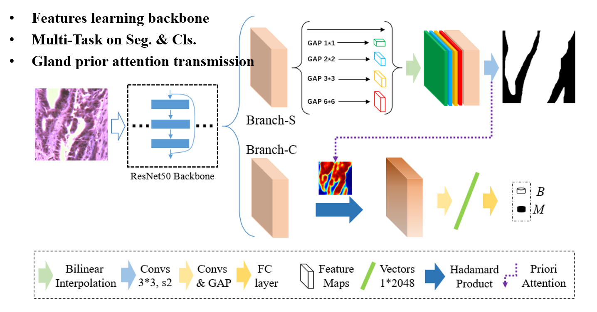
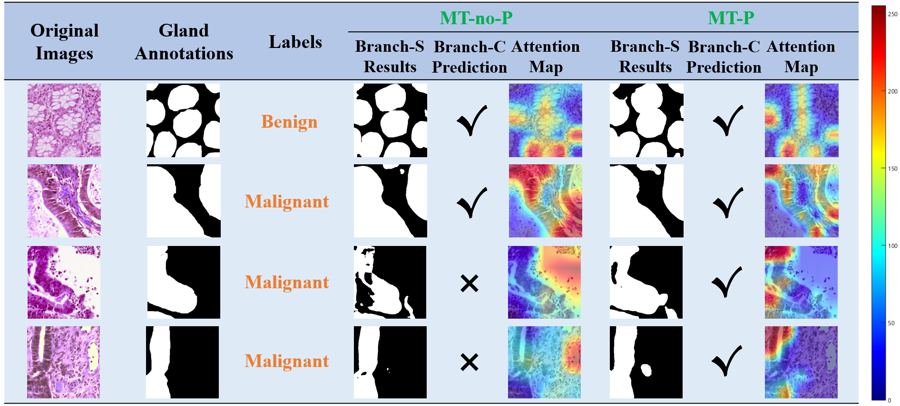

# Pathological-Multi-Task-on-Prior  

- The offical implementation of [**Prior-aware CNN with Multi-Task Learning for Colon Images Analysis**](https://ieeexplore.ieee.org/document/9098703), which was accepted for **Oral Presentation** by [ISBI2020](https://biomedicalimaging.org/2020/).

- **Co-authors**: [Jun Xu](https://faculty.nuist.edu.cn/jxu/zh_CN/index.htm) (*Corresponding author*), [Jiawei Xie](https://github.com/xjw00654), [Chengfei Cai](https://github.com/caicai2526), [Haoda Lu](https://github.com/jydada).



## Abstract   
Adenocarcinoma is the most common cancer, the pathological diagnosis for it is of great significance. Specifically, the degree of gland differentiation is vital for defining the grade of adenocarcinoma. Following this domain knowledge, we encode glandular regions as prior information in convolutional neural network (CNN), guiding the network's preference for glands when inferring.   

In this work, we propose **a prior-aware CNN framework with multi-task learning for pathological colon images analysis**, which contains gland segmentation and grading classification branches simultaneously. **The segmentation's probability map also acts as the spatial attention for grading, emphasizing the glandular tissue and removing noise of irrelevant parts**. 

Experiments reveal that the proposed framework achieves accuracy of 97.04% and AUC of 0.9971 on grading. Meanwhile, our model can predict gland regions with mIoU of 0.8134. Importantly, it is based on the clinical-pathological diagnostic criteria of adenocarcinoma, which makes our model more interpretable.


## Highlights  
- A prior-aware CNN framework with multi-task learning for pathological colon images analysis  
- The multi-task implementation for automatic gland segmentation and grading diagnosis  
- Tissue prior information transmission which based on the clinical pathological diagnostic criterion that acts as spatial attention for pathology-level interpretation


## Results  
#### **Effectiveness of prior knowledge for grading**  

We utilized [CAM](https://openaccess.thecvf.com/content_cvpr_2016/papers/Zhou_Learning_Deep_Features_CVPR_2016_paper.pdf) method to visualize attention maps of branch-C classifier, The figure below shows segmentation results, classification predictions and classifier’s attention maps of pathological images on MT-noP and MT-P models.



## Installation  
### Env Requirements
```
numpy==1.18.1
matplotlib==3.2.1
tqdm==4.45.0
torch==1.5.0
opencv_python==4.2.0.34
scikit_image==0.16.2
torchvision==0.6.0a0+82fd1c8
scipy==1.4.1
Pillow==7.1.2
PyYAML==5.3.1
scikit_learn==0.23.1
skimage
```

### Config Parameters
- You can refer to [Here](results/MTonP/params_setting.txt) for **[CONFIG PARAMS YAML FILE](codes/myParams.yaml)** of our proposal prior-aware CNN framework with multi-task learning (**MT-P**).   
- Also, you can achieve other architectures in ablation study experiments. Refer to `xx/params_setting.txt` in `results` folder.

### Train, Evaluation and Inference
First, just adjust `gpu` in [CONFIG YAML FILE](codes/myParams.yaml) for single GPU or multiple GPUs training. 

Then, for model training, run   
```bash
sh train.sh
```
It will generate `{$1}_log.log` file in `results` folder and save all log info, where `{$1}` is the value of arg param `task` in [CONFIG YAML FILE](codes/myParams.yaml).    

For independent evaluation, run  
```bash
python s5_inference.py
```
and if you want to generate the predicted results simultaneously, pass `gen = True` to `independent_main(arg, gen=False)`.


## Citation  
If the project helps your research, please cite this paper.

```bibtex
@inproceedings{yan2020prior,
  title={Prior-aware cnn with multi-task learning for colon images analysis},
  author={Yan, Chaoyang and Xu, Jun and Xie, Jiawei and Cai, Chengfei and Lu, Haoda},
  booktitle={2020 IEEE 17th International Symposium on Biomedical Imaging (ISBI)},
  pages={254--257},
  year={2020},
  organization={IEEE}
}
```

## Acknowledgement  
Many thanks to ShuaiHui, who really helped me a lot on this work.

## Contact  
If you have any problems, just raise an issue in this repo.
